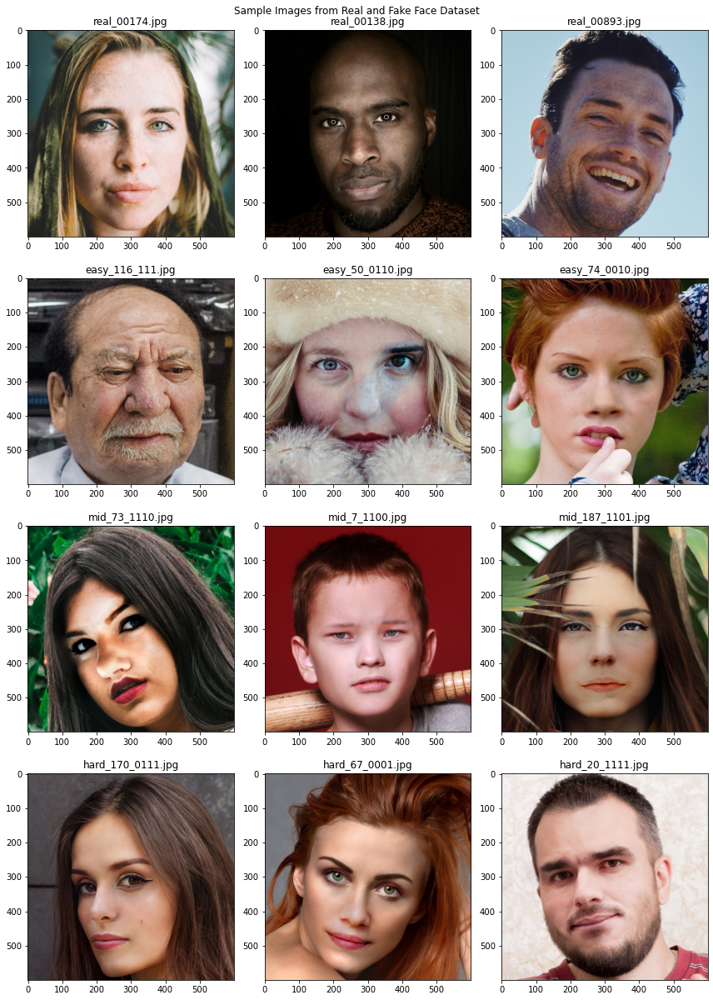
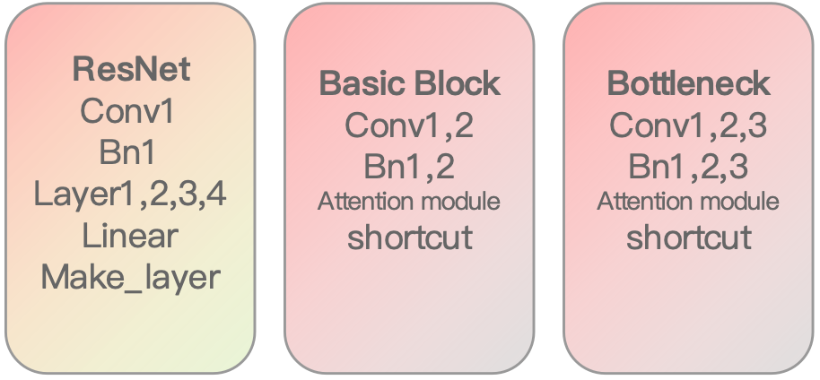
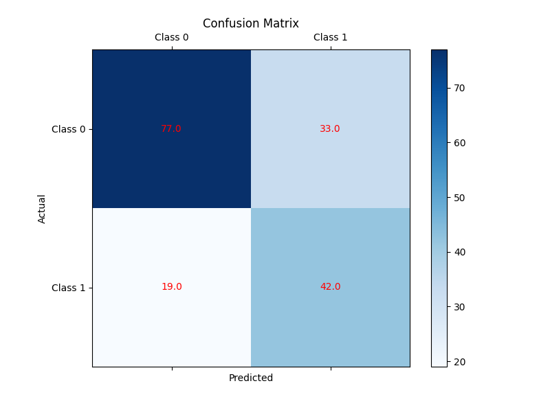
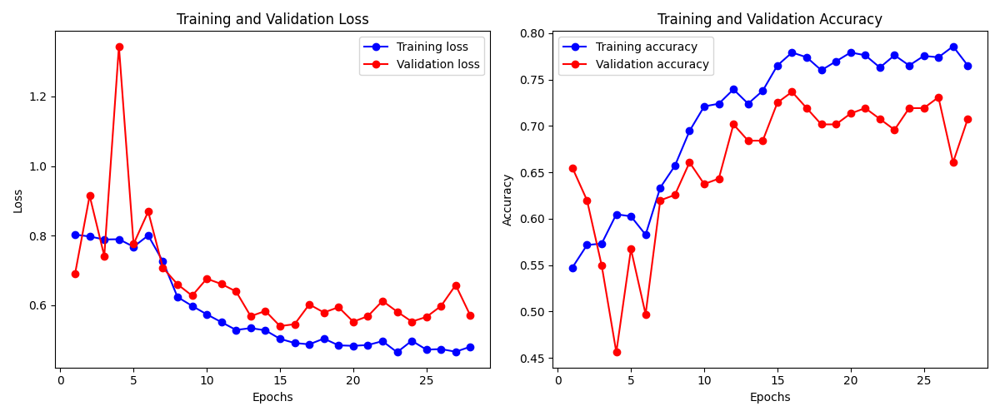
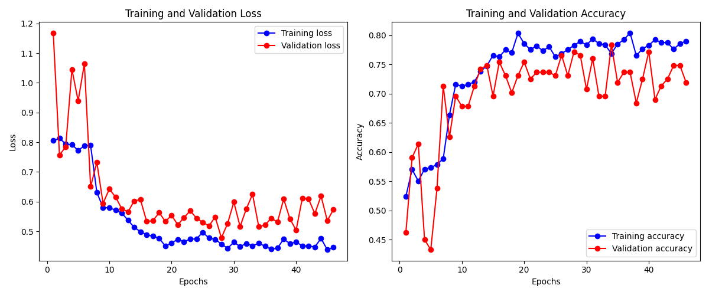
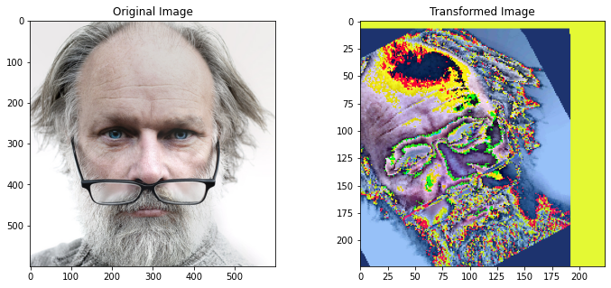

# Distinguishing Real from AI-Generated Images Prototype

## Introduction
With advancements in AI-generated media, distinguishing real human faces from AI-generated deepfake images has become a significant challenge. This project aims to develop a **deep learning-based prototype** to classify real and AI-generated images using **computer vision and pattern recognition techniques**. The system employs **Convolutional Neural Networks (CNNs) and Transfer Learning** to achieve accurate classification.

## Features & Objectives
- **Image Classification**: Detects whether an image is a real human face or an AI-generated image.
- **Deep Learning Models**: Utilizes CNN architectures and transfer learning (e.g., **ResNet, MobileNetV2**) for classification.
- **User-Friendly Interface**: A web-based UI allows users to upload images for real-time classification.
- **Performance Evaluation**: Measures classification accuracy using metrics such as **Confusion Matrix, AUROC, and F1 Score**.

## Methodology
### 1️⃣ Dataset
- **Real Faces**: Collected from various real-world face datasets.
- **AI-Generated Faces**: Includes images from popular GAN-based models such as **StyleGAN, BigGAN**.
- **Preprocessing**:
  - Image resizing (**128x128, 256x256**)
  - Noise removal using **Kalman filtering**
  - Normalization, rotation, flipping for augmentation

📌 **Sample Dataset Preview**:

---

### 2️⃣ Model Architecture
We experimented with two classification approaches:
#### **1. Custom CNN Model**
- **Input**: 27648 features
- **Layers**:
  - 2D Convolutional layers (filters: **32, 16**, kernel size: **3x3**)
  - **Flatten & Dropout (0.25)**
  - Fully connected **Softmax Output** layer
- **Training Accuracy**: **61.0%**
- **Testing Accuracy**: **31.08%**

#### **2. Transfer Learning - MobileNetV2**
- **Input Size**: 96x96 pixels
- **Pretrained MobileNetV2 backbone**
- **Final layer with 8 neurons, Dropout = 0.1**
- **Training Accuracy**: **55.8%**
- **Testing Accuracy**: **41.93%**
- **Higher Generalization** in classification

📌 **Confusion Matrix**:

---

### 3️⃣ Training Process
- **Loss Function**: Cross-Entropy Loss
- **Optimizer**: Adam (`lr=0.0001`)
- **Epochs**: **150 epochs**
- **Evaluation Metrics**:
  - **Accuracy**
  - **Precision-Recall Curve**
  - **AUROC Score**
  - **F1 Score**

📌 **Training & Validation Metrics**:

---

## Results & Performance
| Model Type      | Training Accuracy | Testing Accuracy | F1 Score |
|----------------|------------------|------------------|----------|
| **Custom CNN** | 61.0%            | 31.08%           | 0.42     |
| **MobileNetV2** | 55.8%            | 41.93%           | 0.51     |

📌 **Training Performance (Extended Epochs)**:

📌 **Feature Transformation Example**:

---

## Expected Future Improvements
🔹 **Enhance dataset diversity** with more real and AI-generated images.  
🔹 **Optimize model architecture** by implementing **ResNet** for improved accuracy.  
🔹 **Integrate web-based real-time classification UI** for user uploads.  
🔹 **Experiment with multimodal detection** (image + metadata analysis).  

---

## Environment & Dependencies
- **Platform**: Python, PyTorch, TensorFlow
- **Libraries**:
  - `torch`, `torchvision`
  - `numpy`, `matplotlib`
  - `OpenCV`, `scikit-learn`

---

## Team Members
- **Liao Yijie** - System Architecture, Model Development, UI Design, Data Preprocessing
- **Shao Zixuan** - Data Preprocessing, Model Training, Performance Analysis

📩 Contact: [Emails]

## References
1. **Tolosana et al. (2020)**, *Deepfakes and Fake Detection* - [Paper](https://doi.org/10.13140/RG.2.2.34652.51846)
2. **Nguyen et al. (2022)**, *Deep Learning for Deepfakes Detection* - [arXiv](https://arxiv.org/abs/2203.08712)
3. **Raj et al. (2023)**, *Deepfake Detection with CNNs & ResNet* - [IEEE](https://doi.org/10.1109/ICPR59054.2023.10084673)

---
